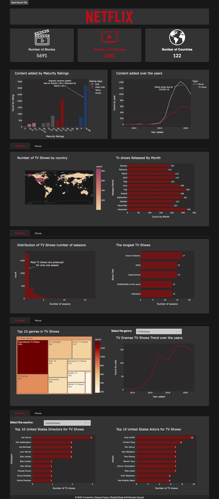

# Data-Visualization (ITI Netflix Dashboard)

### This Project is part of ITI AI 9 Months Program For Data Visualization Course

---

## Made By Team Members:
- [Osama Oun](https://www.linkedin.com/in/osama-oun/)
- [Khaled Ehab](https://www.linkedin.com/in/aleedo/)
- [Mariam Gamal](https://linkedin.com/in/mariam-gamal-50a895145/)

---

## About The Dashboard
In the dashboard you can explore Netflix content and gain multiple insights regarding many feaures such as rating, genre, directors, cast and country ...etc

The project is implemented using the Plotly, Dash, and Bootstrap frameworks in Python.

---
## Deployed Version
Check the live dashboard on [Render](https://netflix-dashboard-iti-mansoura.onrender.com/)

---
## About this Dataset: 
You can check the dataset source from [Kaggle](https://www.kaggle.com/datasets/shivamb/netflix-shows)

Netflix is one of the most popular media and video streaming platforms. They have over 8000 movies or tv shows available on their platform, as of mid-2021, they have over 200M Subscribers globally. This tabular dataset consists of listings of all the movies and tv shows available on Netflix, along with details such as - cast, directors, ratings, release year, duration, etc.

---

